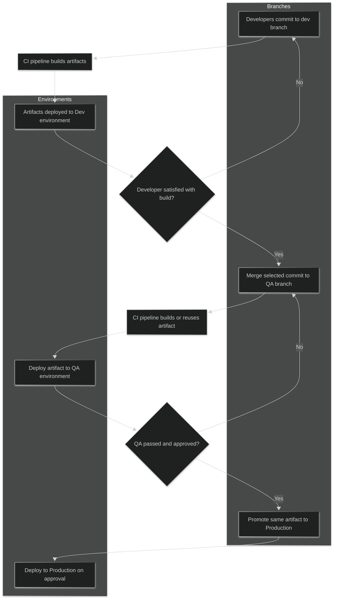

# gitflow-samples

```mermaid
---
config:
  layout: dagre
  theme: dark
  look: neo
---
flowchart TD
 subgraph Branches["Branches"]
        A["Developers commit to dev branch"]
        E["Merge selected commit to QA branch"]
        I["Promote same artifact to Production"]
  end
 subgraph Environments["Environments"]
        C["Artifacts deployed to Dev environment"]
        G["Deploy artifact to QA environment"]
        J["Deploy to Production on approval"]
  end
    A --> B["CI pipeline builds artifacts"]
    B --> C
    C --> D{"Developer satisfied with build?"}
    D -- Yes --> E
    E --> F["CI pipeline builds or reuses artifact"]
    F --> G
    G --> H{"QA passed and approved?"}
    H -- Yes --> I
    I --> J
    D -- No --> A
    H -- No --> E
```
